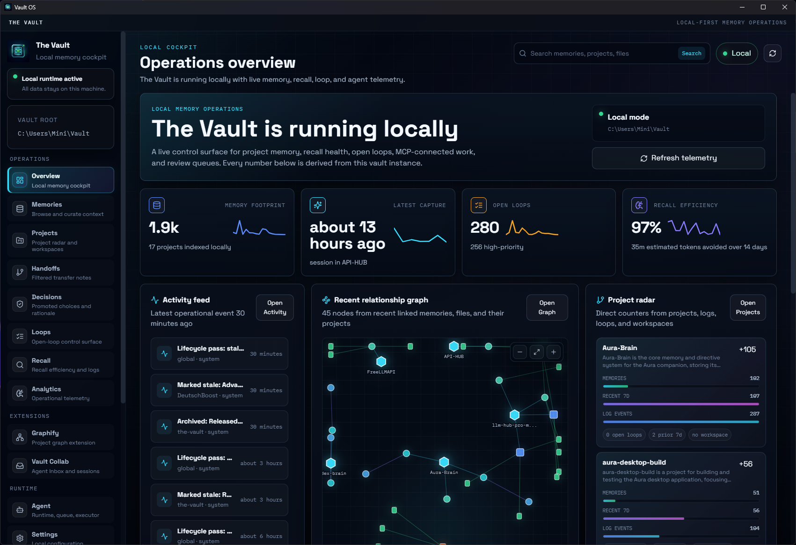
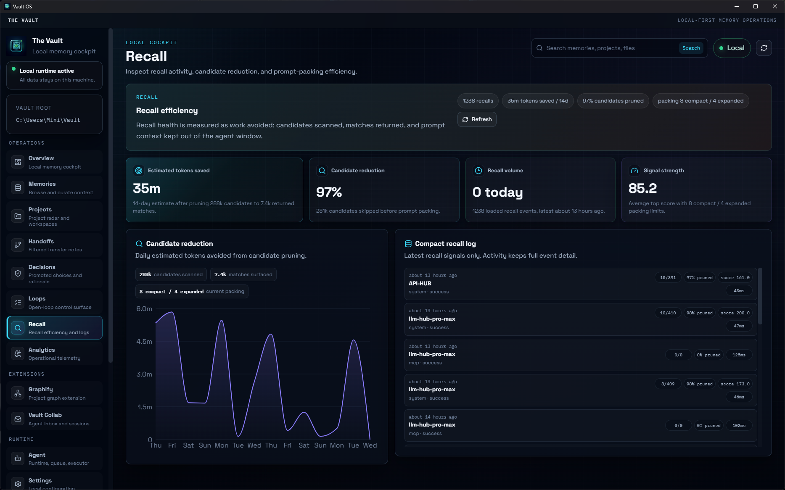
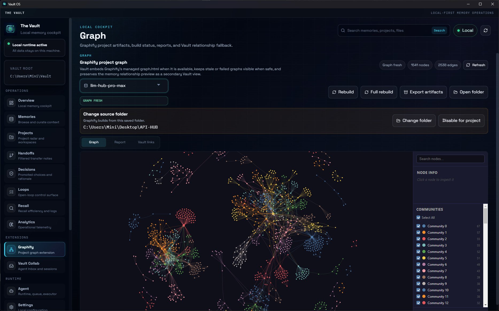
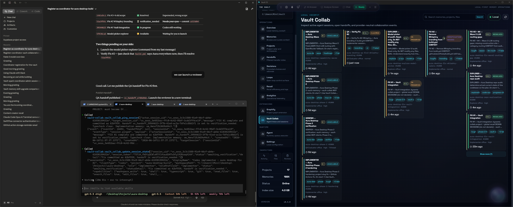
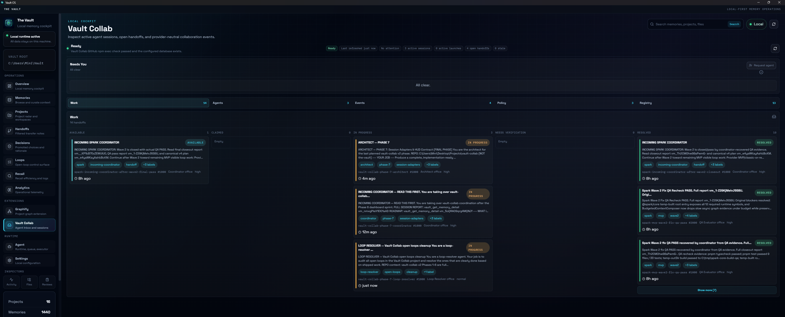
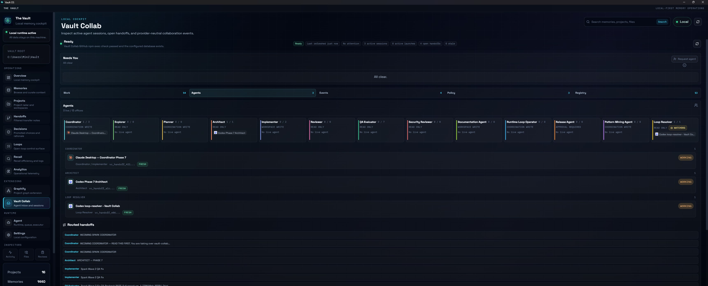

# The Vault


[](https://github.com/aliihsaad/the-vault/actions/workflows/release-windows.yml)


The Vault is a local-first memory operating system for AI-assisted work. It gives coding agents and human operators a durable project memory layer: decisions, handoffs, implementation summaries, task results, project relationships, and recallable context survive across sessions instead of being lost in chat history.

It ships as a TypeScript workspace with a shared core engine, command-line interface, MCP server, and Electron desktop console. Windows releases also bundle their own `vault-memory` MCP runtime, so installed users can connect Codex, Claude Desktop, or Claude Code without keeping the source repo on disk.

The Vault also includes an optional Graphify extension. When enabled for a project, Vault manages the Graphify runtime and artifacts, embeds Graphify's generated project graph in the desktop app, and exposes graph-aware MCP tools so agents can ask structural questions before reading large parts of a repository.

The Vault also includes an optional Vault Collab extension: a live, provider-neutral multi-agent collaboration layer with sessions, roles, handoff inboxes, launch requests, policy packs, and append-only discussions over its own separate local SQLite store (the memory engine only reads it). Agents coordinate by pulling their own inbox via a `receive` work-loop. New workers launch only after explicit user approval; on Windows the app can open a visible PowerShell worker window, and every approved launch still exposes a copyable command fallback.

## The 60-Second Version

- AI agents forget between sessions, even when the project has a long history.
- The Vault stores project memory outside the model, on your machine.
- Agents ask the Vault MCP server for relevant context instead of reading the whole memory store.
- Graphify can add a local project graph so agents can narrow file reads through graph queries, paths, neighbors, and impact checks.
- Work can continue later from Codex, Claude Desktop, Claude Code, or another MCP client.
- Vault does not silently spawn agents; launch requests require explicit approval and use a visible terminal or copyable command fallback.
- You stay in control because memory is local, inspectable, and important cleanup changes are reviewable.

## How It Feels To Use

| Without The Vault | With The Vault |
| --- | --- |
| Start a new AI session. | Start a new AI session. |
| Re-explain the project state. | The agent recalls the current project state. |
| Rediscover decisions and old bug causes. | The agent sees recent decisions, files touched, and next steps. |
| Repeat handoff work manually. | The agent saves a new handoff for the next session. |

The result is not magic memory. It is a practical continuity layer: the important project facts are saved, ranked, reviewed, and reused when they are relevant.

## Visual Overview

### System Topology

```text
Codex / Claude / Agent
        |
        v
Vault MCP Server
        |
        v
Vault Core
        |
        +--> Memory Store
        +--> Task Executor
        +--> Desktop Console
```

### Cross-Agent Continuity

```text
Codex implements change
        |
        v
Vault saves files touched, intent, decisions, next steps
        |
        v
Claude recalls context later
        |
        v
Claude reviews, debugs, or continues the work
```

### Recall Funnel

```text
Stored memories
        |
        v
Candidate search
        |
        v
Ranking and pruning
        |
        v
Recall pack
        |
        v
Injected into agent context
```

### Project Hygiene

```text
Naming drift / duplicate projects
        |
        v
Vault detects related records
        |
        v
Proposal generated
        |
        v
Human review
        |
        v
Canonical project memory
```

## Why It Exists

AI coding sessions are productive but forgetful. The next agent often has to rediscover architecture decisions, bug causes, deployment notes, naming decisions, and unfinished work. The Vault turns that context into structured local memory that can be saved, ranked, recalled, curated, and reused by multiple clients.

The goal is not to replace a repo, issue tracker, or documentation site. The Vault fills the space between them: high-signal operational memory for ongoing work.

## Who This Is For

- Developers using Codex, Claude Code, Claude Desktop, or other MCP-aware tools.
- People juggling multiple projects where decisions and handoffs get scattered.
- AI-assisted workflows that need continuity across sessions and agents.
- Local-first users who do not want memory locked inside one chat product.
- Small teams that want durable implementation context without adopting a heavy knowledge system.

## Real-World Scenarios

### Resume a project after days or weeks

Ask an agent to recall the project before it starts work. The Vault can surface the current phase, latest decisions, open issues, files touched, and saved next steps so the session starts from the real project state.

### Switch between Codex and Claude

One agent can implement a change and save the handoff. Later, another client can recall the same project context through MCP and continue from the saved intent, decisions, and file references.

### Debug with historical context

Before debugging, an agent can recall recent changes, related bug notes, prior fixes, and implementation files. That reduces time spent rediscovering what changed and why.

### Keep project identity clean

Long-running AI work can create naming drift: old project names, duplicate records, or inconsistent casing. The Vault tracks canonical project decisions, detects related records, and supports reviewable merge workflows.

### Use Vault while juggling multiple projects

Inactive projects stay warm. When you return, their decisions, handoffs, and next steps are still available without keeping every detail in your head or in a single chat thread.

## Use Cases

- Continue feature work across Codex, Claude, and desktop sessions without re-explaining the project.
- Save implementation handoffs with exact files touched, decisions made, and next steps.
- Record canonical project decisions such as naming, architecture, release strategy, and integration rules.
- Recall relevant prior context before debugging or changing a feature.
- Maintain project identity when names drift or duplicate project records appear.
- Keep local task results, summaries, and delegated research attached to the right project.
- Inspect and curate memory through a desktop dashboard instead of raw files.
- Connect MCP clients to one shared local memory source.

## What Makes It Different

The Vault is not:

- a chat history archive
- a generic notes app
- a replacement for GitHub issues or documentation
- memory locked inside one model provider
- a dump of every saved note into every prompt
- an unsupervised Codex or Claude process spawner

The Vault is:

- an external project memory layer
- local-first by default
- MCP-accessible from multiple clients
- ranked and pruned recall for agent context
- cross-agent continuity for AI-assisted work
- project lifecycle hygiene for naming drift, duplicates, and cleanup

## Trust And Control

- Storage is local-first: memory files and SQLite state live on your machine.
- MCP clients receive recall packs, not the entire memory store.
- Destructive cleanup uses lifecycle states and review before final deletion.
- Client setup backs up existing config files before changing them.
- The desktop setup flow edits only Vault-owned MCP entries and leaves other client config intact.
- The desktop UI lets you inspect saved memory, file placement, activity logs, project proposals, and pending-delete flows.

## Core Concepts

| Concept | Meaning |
| --- | --- |
| Project memory | Structured records tied to a project: decisions, sessions, plans, handoffs, artifacts, references, and summaries. |
| Recall packs | Ranked, compact sets of relevant memories returned for a task or session. |
| MCP clients | Tools such as Codex, Claude Desktop, and Claude Code that connect to Vault through the `vault-memory` MCP server. |
| Agent skills | Client-facing guide files that teach agents when to recall, when to save, and how to structure memory. |
| Graphify extension | Optional Vault-managed graph runtime that builds project graph artifacts, serves `graph.html`, and powers graph-aware recall. |
| Task executor | A Vault runtime that can process queued tasks, store results, and expose task status through MCP and desktop surfaces. |
| Project hygiene | Naming, relationship, duplicate, and canonical-decision workflows that keep project memory organized. |
| Lifecycle states | Reversible memory states such as `active`, `stale`, `archived`, and `pending_delete` before final deletion. |

## Feature Overview

| Area | What The Vault Provides |
| --- | --- |
| Structured memory | Saves typed records with project, subject, summary, tags, keywords, priority, status, related files, and next steps. |
| Smart recall | Returns ranked memory packs using project match, keywords, tags, memory type, explicit memory UID matches, recency, promoted decisions, and related context. |
| Graphify extension | Optional project graph integration that detects or installs Graphify, stores artifacts under Vault-managed paths, embeds real `graph.html`, and keeps the rest of Vault working when Graphify is missing or failed. |
| Graph-aware recall | Combines Vault memory recall with Graphify context when a fresh or usable graph exists, while logging graph use, fallback reasons, and token-savings telemetry locally. |
| Vault Collab extension | Optional live collaboration layer: provider-neutral sessions with roles, handoff inboxes, append-only discussions, lease-based ghost cleanup, policy packs, event registry, and permission-gated agent launch — surfaced in a desktop operator cockpit (Needs You plus Work / Agents / Events / Policy / Registry). Uses a separate local SQLite store and pull-based (`receive`) delivery. |
| Desktop console | Electron app with overview, memories, projects, handoffs, decisions, loops, recall, analytics, Graphify, Vault Collab, agent runtime, settings, and inspector tabs. |
| MCP integration | `vault-memory` MCP server for external agents and clients, including memory tools, task tools, and Vault-owned Graphify graph tools. |
| One-click client setup | Desktop Settings -> Client setup can connect Codex, Claude Desktop, and Claude Code to the bundled memory runtime, add Vault Collab as a second MCP server, and install/remove the matching agent guide files. |
| CLI access | Command-line entry point over the same core APIs. |
| Project hygiene | Project descriptions, project listing, naming drift handling, duplicate project merging, and relationship tracking. |
| Lifecycle controls | Reversible memory states such as `active`, `stale`, `archived`, and `pending_delete` before deletion. |
| Task records | Queued task metadata, model routing, executor status, task results, retries, and saved summaries. |
| Project momentum | Per-project week-over-week activity delta (↑/↓/inactive) shown on the Overview to make stagnating projects visible. |
| Open loops panel | Aggregated unfinished work — items with non-empty `next_steps` plus stale debugging routines — bucketed by derived priority (high/medium/low) with snooze support via `snoozed_until`. |
| Close-the-loop on recall | `vault_recall_context` returns a capped, pressure-ranked `open_loops` field so agents surface unfinished work back to the user. Dedicated MCP tools support single-loop resolution plus exhaustive loop audits and batch resolution. |
| Local privacy | SQLite database and memory files stay on the user's machine unless the user explicitly pushes or exports them. |

## Interfaces

The Vault is built around one shared core package and several thin interfaces:

- **Desktop app**: the primary operator UI for installed users.
- **MCP server**: exposes memory tools to Codex, Claude Desktop, Claude Code, and other MCP clients.
- **CLI**: useful for quick local checks and scripts.
- **TypeScript core**: reusable services for saving, recalling, ranking, project maintenance, tasks, and settings.

## Screens And Workflows

The desktop app currently includes:

- **Overview**: local memory status, activity, recall, open loops, relationship graph, and project radar in one cockpit.
- **Memories**: search, filter, inspect, edit, and save structured memory items.
- **Projects**: searchable project directory with memory counts, descriptions, workspace signals, momentum, and delete/merge controls.
- **Handoffs**: filtered workspace for transfer notes and preserved next actions.
- **Decisions**: promoted project choices and rationale.
- **Loops**: open-loop control surface with project/routine/tag filtering, snooze, open, and resolve actions.
- **Recall**: inspect recall activity, candidate pruning, prompt packing efficiency, and compact recall logs.
- **Analytics**: operational charts from logs, memory state, and task queue counters.
- **Graphify**: choose a project source folder, build or rebuild Graphify artifacts, inspect graph freshness, open reports, and view the real Graphify graph.
- **Vault Collab**: operator cockpit for the optional collaboration extension — Needs You plus Work, Agents, Events, Policy, and Registry tabs. Request agents for a selected project/workspace, approve or reject launch requests, and inspect role/session state.
- **Agent**: inspect Vault's built-in task runtime, delegated task queue, executor events, and runtime controls.
- **Settings**: configure runtime behavior, lifecycle policy, Graphify and Vault Collab extension detection/install, prompt guides, model routing, and client setup.
- **Inspectors**: Activity, Files, and Reviews tabs for operational logs, vault files, project proposals, and pending deletes.

### Operations Overview

The Overview is the daily operator surface: live local status, activity, project radar, recent relationship graph, open loops, recall trends, telemetry, and review queues.



### Open Loops

The Loops page turns unfinished work into an explicit queue. Operators can filter by project, routine, and tag, inspect the selected loop, then open, snooze, or resolve it.


### Recall Efficiency

Recall shows how much prompt context Vault avoided sending to the agent window: estimated tokens saved, candidate pruning, recall volume, signal strength, and a compact signal log. When Graphify is enabled, recall activity also records graph-aware context use so operators can see when the project graph is contributing to the answer path.



### Graphify Project Graph

The Graph page is now Graphify-aware. Vault keeps Graphify optional, but when it is installed and enabled for a project, Vault stores graph artifacts under managed extension paths, embeds Graphify's generated `graph.html`, preserves the last good graph when rebuilds fail, and asks for a source folder before building projects that do not yet have one.



### Vault Collab Cockpit

Vault Collab is a separate live coordination layer for multi-agent work. The desktop cockpit shows approval-needed items, routed handoffs, role-grouped sessions, policy packs, and the event registry. Launches stay permission-gated: after approval, The Vault opens a visible worker terminal on supported Windows builds or leaves a copyable command for manual launch.







### Memory Bank

The Memory Bank is the main inspection surface for saved project context: search, filter, select a record, inspect metadata, and review the full saved summary without leaving the desktop console.

## Install For Normal Use

For Windows users, use the GitHub Release installer:

1. Open the repository's **Releases** page.
2. Download `The-Vault-<version>-win-x64.exe`.
3. Run the installer.
4. Open **The Vault**.
5. Go to **Settings -> Client setup**.
6. Connect Codex, Claude Desktop, or Claude Code.
7. Restart the client so it launches the updated `vault-memory` server.

Do not download the `.blockmap` file unless you are debugging release assets. It is used by updater tooling, not manual installation.

Installed builds store user data separately from the app installation. Updating the app should not delete an existing vault database or memory files.

Upgrading from a 0.2.x build auto-migrates existing Vault MCP entries and the Claude Code skill install path on app startup when a previous Vault connection is detected.

## Install From Source

Requirements:

- Node.js 22 or newer
- pnpm 10 or newer
- Git
- Windows if you want to build the NSIS installer locally

Install dependencies:

```powershell
pnpm install
```

Run the desktop app in development:

```powershell
pnpm --filter @the-vault/desktop dev
```

Run the CLI directly:

```powershell
pnpm --filter @the-vault/cli dev -- status
```

Run the MCP server over stdio:

```powershell
pnpm --filter @the-vault/mcp-server dev
```

## MCP Setup

### Installed Desktop App

Installed releases include a bundled MCP sidecar runtime:

```text
resources/mcp/node.exe
resources/mcp/dist/index.js
```

Use **Settings -> Client setup** in the desktop app. The UI writes only Vault-owned MCP entries such as `vault-memory` and `vault-collab`, leaves other client config entries intact, shows connection status, and includes a troubleshooting panel.


### Source Checkout

For development machines using the repo directly:

```powershell
pnpm setup:mcp
```

That command:

- builds `@the-vault/core` and `@the-vault/mcp-server`
- deploys a standalone MCP runtime to `mcp-standalone/`
- verifies an MCP initialize handshake
- backs up existing client config files before editing
- writes `vault-memory` entries for supported clients

Configure only one client:

```powershell
pnpm setup:mcp -- --client codex
pnpm setup:mcp -- --client claude-desktop
pnpm setup:mcp -- --client claude-code
```

Dry-run the setup without changing files:

```powershell
pnpm setup:mcp:dry-run
```

## Agent Skill Guides

The repo includes agent-facing operating guides:

- `skills/claude-vault-skill.md`
- `skills/codex-vault-skill.md`
- `skills/claude-vault-collab-skill.md`
- `skills/codex-vault-collab-skill.md`

Installed releases package these guide files under app resources. The desktop **Client setup** page can install or reference them at:

- Claude Code Vault memory: `%USERPROFILE%\.claude\skills\vault-memory\SKILL.md`
- Claude Code Vault Collab: `%USERPROFILE%\.claude\skills\vault-collab\SKILL.md`
- Codex memory and Collab references: `%USERPROFILE%\.codex\AGENTS.md`

The guides teach agents when to recall, when to save, how to structure memory, how to bootstrap client brain projects, and how to use queued Vault tasks.

Client brain projects are provider-specific operating memory, not fixed roles:

- Codex uses `Codex-brain`.
- Claude Code uses `claude-code-brain`.
- Claude Desktop uses `claude-desktop-brain`.

Each guide tells the client to call `vault_list_projects` first, create one canonical bootstrap memory if its brain project is missing, recall the brain for durable operating lessons, and keep ordinary implementation facts in the relevant project memory.

They also include Graphify routing guidance. For code structure, dependency, path, neighbor, and impact questions, agents should call Vault's Graphify MCP tools first instead of jumping straight to broad file search. Vault remains the interface; agents should not call the raw Graphify CLI during normal use.

Vault Collab has separate opt-in guide files because it is a live coordination layer, not durable memory. Vault MCP stays the memory layer; Vault Collab MCP is the session, attention, handoff, discussion, permission, and launch-request layer when its `vault_collab_*` tools are attached. Clients should read `vault_collab_get_agent_guide` as the live loop, register sessions deliberately, drain their own attention feed, claim handoffs only when idle or user-approved, and save full execution briefs back to Vault memory.

## Graphify Extension

Graphify is integrated as an optional local extension, not vendored into The Vault. Vault owns the lifecycle and policy surface, while Graphify owns graph extraction and the generated graph UI.

What Vault manages:

- runtime detection and install guidance from **Settings -> Extensions -> Graphify**
- per-project source folder selection
- Graphify builds into Vault-managed extension directories
- artifact discovery for `graph.json`, `GRAPH_REPORT.md`, and `graph.html`
- safe desktop embedding of the generated graph
- stale, failed, or missing graph fallback without breaking memory save/recall
- local telemetry for graph-aware recall and token-saving estimates

Graphify adds these agent-facing MCP tools through Vault:

| Tool | Purpose |
| --- | --- |
| `vault_recall_with_graph_context` | Combine ranked Vault memory with graph-guided project context. |
| `vault_graphify_status` | Check runtime, project graph state, freshness, and artifact availability. |
| `vault_graphify_build_project_graph` | Queue or run a project graph build through Vault's managed pipeline. |
| `vault_graphify_query` | Ask a structural graph question for a project. |
| `vault_graphify_get_node` | Fetch a file or symbol node and compact metadata. |
| `vault_graphify_get_neighbors` | Expand context around a known graph node. |
| `vault_graphify_shortest_path` | Find the graph path between two files or symbols. |
| `vault_graphify_explain_impact` | Estimate likely affected files and tests for a proposed change. |

If Graphify is not installed, disabled, stale, or failed, Vault keeps normal memory features working and reports the fallback reason instead of hiding the failure.

## Vault Collab Extension

Vault Collab is an optional, provider-neutral collaboration layer for real-time multi-agent work, kept separate from the memory engine: it uses its own local SQLite store and the Vault core only ever reads it, so memory works identically whether Vault Collab is on, off, or uninstalled.

It lets Codex, Claude Code, and other MCP clients coordinate live:

- Sessions register with a role; the live roster auto-cleans stale/ghost sessions via lease + heartbeat.
- Role profiles describe the session's operating posture, capability scope, and suggested next roles.
- Work is shared as handoffs (publish -> claim -> progress -> resolve) with labels, queues, dependencies, and append-only discussion threads.
- **Pull-based delivery:** each agent drains its own attention feed with `receive`, so coordination never depends on injecting messages into another agent's terminal.
- **Permission-gated launch:** an agent or user can request a new worker for a selected project and workspace. The user approves, rejects, or cancels in the cockpit. On supported Windows builds The Vault opens a visible PowerShell worker window after approval; otherwise it shows the approved command to run manually.
- **Operator cockpit:** Needs You plus Work, Agents, Events, Policy, and Registry tabs show launch approvals, handoff state, session HUDs, role profiles, event streams, policy packs, and the event type registry.

Vault Collab ships as a separate package/repo and connects through its own `vault_collab_*` MCP tools. Connect it from **Settings -> Client setup -> Connect Vault Collab MCP**.

## Memory Model

Common memory types:

- `session`
- `summary`
- `decision`
- `plan`
- `artifact`
- `handoff`
- `reference`

## Memory Quality Principles

A good memory is specific enough to help a future agent act without re-reading the whole repo. Include:

- exact project name
- precise subject
- what changed
- why it changed
- files touched
- decisions made
- next steps
- tags and keywords

High-quality memory improves future recall. Vague saves create vague recall packs; specific saves give agents concrete project state, file context, and next actions.

## Recall Model

Recall is designed to return useful context, not every matching record. Ranking uses signals such as:

- exact project match
- subject and keyword overlap
- tag overlap
- memory type
- priority
- promoted or canonical status
- recency
- relationship expansion
- lifecycle status

Promoted and canonical memories are intentionally boosted because they represent durable project truths.

Open loops have two MCP surfaces:

| Tool | Purpose |
| --- | --- |
| `vault_recall_context` | Returns the most urgent few `open_loops` for close-the-loop prompts during ordinary recall. |
| `vault_resolve_loop` | Atomically resolves one loop with an outcome: `fixed`, `wont_fix`, `obsolete`, or `duplicate`. |
| `vault_list_open_loops` | Exhaustively lists active explicit open loops with pagination for audits and cleanup passes. |
| `vault_count_open_loops` | Counts open loops, optionally grouped by project. |
| `vault_resolve_loop_batch` | Resolves many confirmed loops at once with partial success reporting. |

## Project Hygiene

The Vault treats project identity as data, not just a folder name. It supports:

- searchable project listing
- project descriptions
- project relationship records
- duplicate and old-name cleanup
- workspace registration
- canonical naming decisions
- merge workflows for duplicated project entries
- desktop delete controls that confirm the action, merge memories into the fallback project, and remove the source project row

This matters because long-running AI work often creates naming drift across sessions and clients.

## Lifecycle Management

The Vault avoids immediate destructive cleanup. Low-signal records can move through reversible states:

```text
active -> stale -> archived -> pending_delete -> deleted
```

Deletion requires explicit confirmation. This keeps recall quality manageable without silently losing useful history.

## Workspace Layout

```text
packages/
  core/          Shared Vault engine, database, ranking, services, task system
  cli/           Command-line entry point over core APIs
  mcp-server/    MCP stdio server for agent integrations
  desktop/       Electron and React desktop console

docs/            Protocol notes, roadmap status, implementation plans
skills/          Agent-facing Vault memory guides
scripts/         MCP setup, deployment, and maintenance scripts
.github/         Release workflow for Windows installer builds
```

Core logic belongs in `packages/core`. The CLI, MCP server, and desktop app should stay thin wrappers around shared core APIs.

## Common Commands

```powershell
pnpm install
pnpm lint
pnpm test
pnpm build
pnpm --filter @the-vault/desktop dev
pnpm --filter @the-vault/cli dev -- status
pnpm --filter @the-vault/mcp-server dev
pnpm setup:mcp
```

## Build And Release

Build everything locally:

```powershell
pnpm build
```

The root build:

1. builds core, CLI, and MCP packages
2. deploys the standalone MCP runtime
3. builds the Electron desktop app
4. creates a Windows installer under `packages/desktop/dist/`

Release builds are created by GitHub Actions when a version tag is pushed:

```powershell
git tag -a vX.Y.Z -m "vX.Y.Z"
git push origin vX.Y.Z
```

The workflow typechecks the repo, builds the installer, verifies the bundled MCP sidecar, uploads artifacts, and publishes a GitHub Release. See `CHANGELOG.md` for the current release notes.

## Data And Privacy

The Vault is local-first:

- memory data is stored locally
- SQLite is used for registry and operational state
- memory files live under the configured Vault root
- Graphify runtime state and graph artifacts live under Vault-managed local extension paths
- client config writes are local machine changes
- generated build output and local vault data should not be committed

Secrets and machine-specific files should stay out of Git:

- `.env*`
- local Vault data
- generated `dist/` folders
- generated `mcp-standalone/`
- client-local settings
- API keys and runtime state

## Troubleshooting

### Desktop Opens But MCP Client Does Not See Vault

Use **Settings -> Client setup -> Troubleshoot MCP**. Check that the configured client points to the bundled runtime for installed builds or `mcp-standalone/dist/index.js` for source checkouts.

Restart Codex, Claude Desktop, or Claude Code after changing MCP config.

### Codex Skill Shows Not Configured

Open **Settings -> Client setup** and click **Install guide** under Codex skill. Installed builds write the guide reference to:

```text
%USERPROFILE%\.codex\AGENTS.md
```

Then refresh the connection status.

### Windows Build Fails Around Native Modules

`better-sqlite3` is a native dependency. Stop running desktop, MCP, and Node processes that may be holding `better_sqlite3.node`, then rebuild.

### Installed App Uses Existing Dev Data

That is expected when the installed app and source checkout resolve the same Vault root. App updates should not delete existing Vault data.

## Current Maturity

The Vault is usable today for:

- local memory
- MCP integration
- desktop workflows
- client setup
- recall and save flows
- optional Graphify project graphs and graph-aware MCP context
- optional Vault Collab live coordination, handoff routing, policy visibility, and permission-gated worker launch
- exhaustive open-loop audits and batch loop resolution
- task records
- searchable project directory and reviewable delete/merge controls
- Windows installer releases

It is still evolving in these areas:

- recall explainability
- Graphify graph quality, semantic mode tuning, and project relationship views
- Vault Collab managed install/package polish for users without a local checkout
- analytics for usage, recall quality, and project activity
- onboarding polish
- release hardening
- deeper memory curation

See `docs/master-plan-status.md` for a more detailed implementation status map.

## Project Tags

`local-first` `ai-memory` `agent-memory` `mcp-server` `vault-collab` `graphify` `project-graph` `codex` `claude` `electron` `sqlite` `typescript` `developer-tools` `workflow-continuity` `knowledge-management` `task-delegation` `project-context`

## Repository Discipline

- Keep domain behavior in `packages/core`.
- Keep interface packages thin.
- Do not commit generated build output.
- Do not commit local vault data or secrets.
- Prefer focused commits with imperative subjects.
- Do not add `Co-authored-by` trailers unless explicitly requested.

## License

The Vault is licensed under the MIT License. See [LICENSE](LICENSE).
